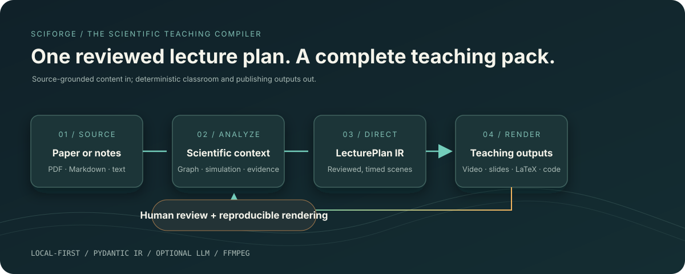
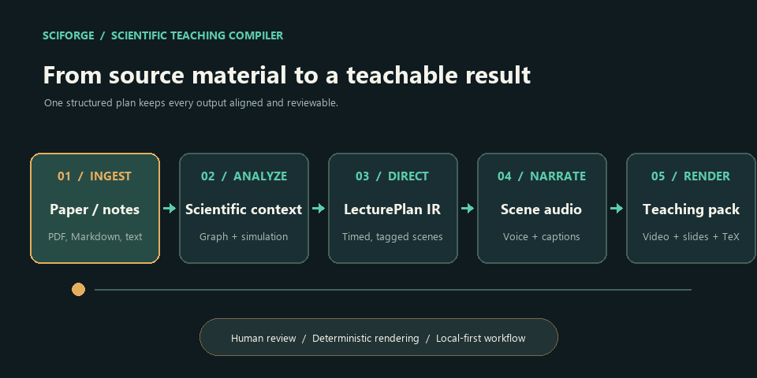
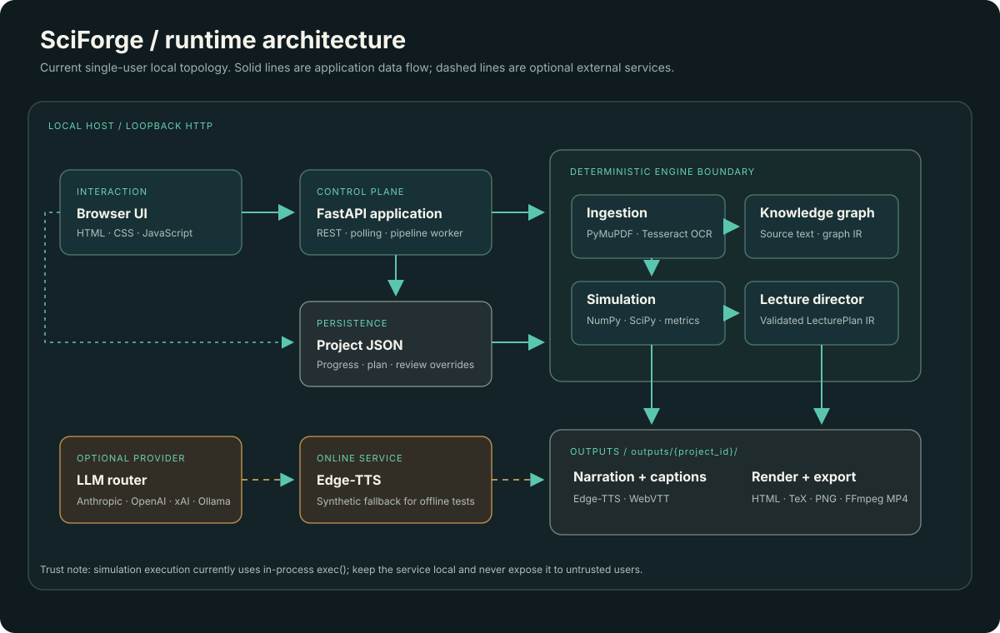
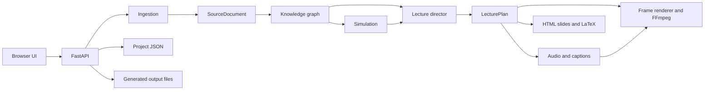

# SciForge

**A local-first scientific teaching compiler.** Turn a paper or field notes into a structured lecture, a narrated video, projector slides, a derivation sheet, and an executable simulation from one reviewable pipeline.



[System design](docs/SYSTEM_DESIGN.md) · [Quick start](#quick-start) · [Demo](#demo) · [API](#api-overview)

## Demo

The animation below shows the stages SciForge runs. The application is a local web app; no hosted demo is currently published. Start it locally and use one of the bundled benchmark papers for a complete end-to-end example.



After compilation, the Scene Director lets you review and edit narration, equations, and titles. Saved edits survive recompilation; old exports are marked stale until the reviewed lecture is rebuilt.

## What it produces

| Artifact | What it contains |
|---|---|
| Lecture video | Scene-based MP4 with synthesized narration, rendered visual cards, and simulation figures. Resolution presets are 720p, 1080p, 2K, and 4K. |
| Classroom deck | Self-contained 16:9 HTML slides with KaTeX equations and keyboard navigation. |
| Derivation sheet | LaTeX source generated from the same lecture plan. |
| Simulation | Runnable Python source plus a deterministic, theme-styled plot and measured metrics. |
| Publishing metadata | Video title, description, tags, and chapter timestamps. |
| Captions | WebVTT subtitles aligned to scene narration. |

The lecture plan is the shared intermediate representation. Each output is rendered from that plan rather than being inferred from another export.

## Quick start

### Requirements

- Python 3.10 or newer
- FFmpeg on `PATH` for MP4 rendering
- Tesseract OCR plus language data for image-only scanned PDF pages; normal text-layer PDFs do not require it
- Python packages in [`requirements.txt`](requirements.txt)

Install and launch from the repository root:

```powershell
python -m pip install -r requirements.txt
python run.py
```

The launcher starts FastAPI at `http://127.0.0.1:8000` and opens the browser. To run without opening a browser:

```powershell
python -m uvicorn backend.app:app --host 127.0.0.1 --port 8000
```

Check runtime capabilities at `http://127.0.0.1:8000/api/health`.

### First lecture

1. Pick a bundled benchmark (Kalman filter, attention, or Neural ODE), or upload a PDF, Markdown, or text file.
2. Choose the theme, narrator persona, audience, duration, and render resolution.
3. Select **Compile Scientific Lecture** and follow progress in the interface.
4. Review scene titles, equations, and narration in **Scene Director & Script**. Save individual edits or regenerate one scene when an LLM provider is configured.
5. Select **Compile Reviewed Lecture** to synthesize updated narration and rebuild slides, LaTeX, captions, and video.
6. Open the classroom deck or download the generated artifacts from **Teaching Pack & Exports**.

The smoke test uses a local synthetic audio fallback when Edge-TTS cannot reach its online service. That keeps the test runnable offline, but it is not a real voice sample.

## Model configuration

Copy `.env.example` to `.env` and add a key for one provider. `.env` is ignored by Git; never commit provider credentials.

| Setting | Purpose |
|---|---|
| `SCIFORGE_LLM_PROVIDER` | `auto`, `anthropic`, `xai`, `openai`, `ollama`, or `none` |
| `SCIFORGE_LLM_MODEL` | Optional provider-specific model override |
| `SCIFORGE_LLM_MAX_CHARS` | Maximum paper text passed to the model |
| `SCIFORGE_LLM_TIMEOUT` | Provider request timeout in seconds |
| `SCIFORGE_OCR_LANGUAGE` | Tesseract language code, default `eng` |
| `OLLAMA_HOST` | Ollama endpoint when using a local model |

Without a configured model, knowledge graph and lecture planning use deterministic topic templates. LLM output is schema-validated; the model proposes teaching content while deterministic code owns scene ids, timing, layout, and rendering.

## Architecture





### Core design rules

- **One lecture IR, multiple deterministic renderers.** `LecturePlan` is the contract shared by playback, video, slides, LaTeX, and captions.
- **AI proposes; the application controls rendering.** LLM calls go through `backend/engines/llm/`; validated drafts are converted into deterministic scene models.
- **Scientific provenance stays visible.** Equations carry `SOURCE`, `DERIVED`, `GENERATED`, or `ASSUMED` tags. Source claims retain citations where available. Displayed simulation metrics come from executed code.
- **Offline completion is a first-class path.** Topic templates provide a fallback when no LLM is configured; TTS has a synthetic audio fallback for local tests.
- **Compilation is observable.** Project state and engine logs are persisted after pipeline stages so the UI can report progress and fallbacks.

Read [docs/SYSTEM_DESIGN.md](docs/SYSTEM_DESIGN.md) for component ownership, data flow, API contracts, failure behavior, and trust boundaries.

## Repository map

```text
backend/
  app.py                 FastAPI routes and background compilation pipeline
  models.py              Pydantic project, document, graph, and lecture IR
  engines/
    ingestion.py         PDF/text extraction and scanned-page OCR fallback
    knowledge.py         LLM-backed or template knowledge graph
    science_sim.py       Deterministic simulations, metrics, and plots
    director.py          Lecture planning, scene normalization, review helpers
    audio_tts.py         Per-scene narration and subtitle generation
    exporter.py          Slides, LaTeX, captions, and publishing metadata
    video_renderer.py    Scene frames, FFmpeg clips, and final MP4
    llm/                 Provider-neutral routing and schema validation
  sample_papers/         Bundled benchmark inputs
frontend/                HTML, CSS, and JavaScript studio
tests/                    Pipeline smoke test and mocked LLM/review tests
docs/
  SYSTEM_DESIGN.md        Detailed architecture and operating boundaries
  assets/                README diagrams and reproducible pipeline animation
```

Generated `outputs/`, persisted local `projects/`, `.env`, and Python caches are excluded from version control.

## API overview

The interactive API documentation is available at `/docs` while the server is running.

| Method | Route | Purpose |
|---|---|---|
| `GET` | `/api/health` | Runtime and provider capability status |
| `POST` | `/api/project/create` | Create a project workspace |
| `POST` | `/api/project/{id}/load-sample/{sample}` | Load a bundled paper |
| `POST` | `/api/project/{id}/upload-paper` | Upload a PDF or notes |
| `POST` | `/api/project/{id}/compile` | Queue the full compilation pipeline |
| `GET` | `/api/project/{id}` | Read project progress, lecture plan, and outputs |
| `PUT` | `/api/project/{id}/scenes/{scene_id}` | Save title, narration, and equation edits |
| `POST` | `/api/project/{id}/scenes/{scene_id}/regenerate` | Regenerate one scene with the configured LLM |
| `POST` | `/api/project/{id}/render-video` | Render a compiled plan at a chosen resolution |

## Development and tests

Run the end-to-end engine smoke test and the offline mocked test suites from the repository root:

```powershell
python tests/test_pipeline.py
python -m pytest tests/test_llm.py tests/test_scene_review.py
```

The pipeline smoke test invokes FFmpeg and attempts Edge-TTS; if online speech is unavailable, it uses the documented synthetic-audio fallback. LLM tests mock provider HTTP calls and do not spend API credits.

## Security and limitations

- SciForge is intended for local use. Keep the server bound to `127.0.0.1`; do not expose it to an untrusted network.
- The custom simulation endpoint currently executes submitted Python with `exec()` in the server process. It is **not a sandbox** and must not receive untrusted or model-generated code.
- OCR is a fallback for image-backed PDF pages. Handwriting, layout reconstruction, and equation recognition are limited; OCR text should be reviewed against the source.
- Edge-TTS is online. Configure no cloud LLM key to use template planning, but narration can still make an online TTS request.
- The generic simulation is illustrative, not an experiment extracted from an arbitrary paper. Treat it accordingly.

## Roadmap

- Improve OCR provenance and figure extraction for scanned papers.
- Run proposed scientific simulations only inside a real isolation boundary.
- Add animated scene rendering and narration-synchronized visual reveals.
- Add local TTS, PDF/PPTX exports, and richer review tools.

## License

No license file is currently included. Until one is added, all rights are reserved by default; do not assume the code is open-source licensed merely because this repository is public.
